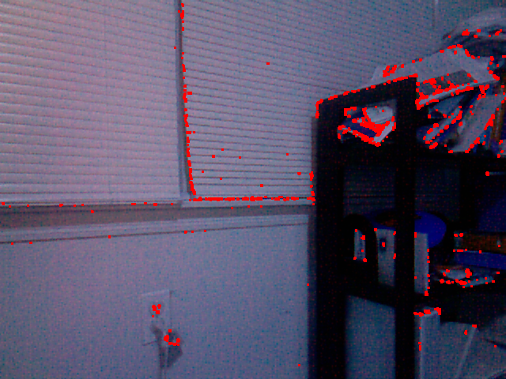

kinect dev
==========

Development files for Kinect module.

<h2>TODO:</h2>
- Extract relevant vertices from image (table corners, object boundaries, etc). (Done, need to improve a bit more on accuracy.) [45%]
- Map extracted vertecies with depth map. [Pending]

 

<h2>Progress/Sample</h2>
- Vertex Extract (Using Corner Harris Algorithm)
 Need to still improve on accuracy.
 
